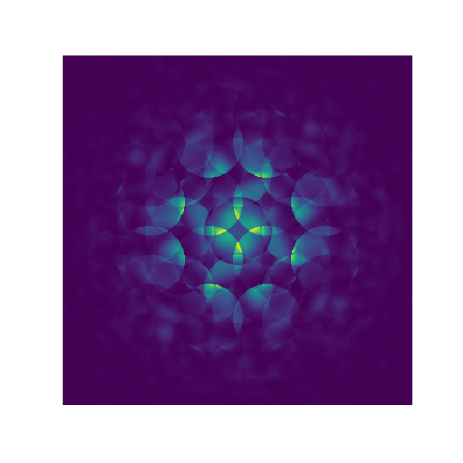

# py_multislice

Python multislice slice code

GPU accelerated using 
[pytorch](https://pytorch.org/)

Ionization based off [Flexible Atomic Code (FAC)](https://github.com/flexible-atomic-code/fac).

# Installation

1. Clone or branch this repo into a directory on your computer

2. In the command-line (Linux or Mac) or your Python interpreter (Windows) in the root directory of your local copy of the repo run

    $ pip install -e .

   All necessary dependencies (pytorch etc.) should also be installed, if you have issues try installing in a fresh anaconda environment.

3. If you would like to perform ionization based TEM simulations, download and install the flexible atomic code (FAC), including the python interface (pfac), from [here](https://github.com/flexible-atomic-code/fac). I've only successfully got this working on Linux, your mileage may vary on Windows operating systems. 

4. As an added precaution, run the Test.py script to ensure everything is working as expected

    $ python Test.py

    You can also run run Orbital_normalization.py to test that the ionization cross-sections are being calculated appropriately.

# Documentation and demos

Documentation can be found [here](https://hamishgbrown.github.io/py_multislice/), for demonstrations and walk throughs on common simulation types see the Jupyter Notebooks in the [Demos](Demos/) folder. The Notebook for STEM-EELS is still under construction.

# Bug-fixes and contributions

Message me, leave a bug report and fork the repo. All contributions are welcome.

# Acknowledgements

A big thanks to [Philipp Pelz](https://github.com/PhilippPelz) for teaching me the ins and outs of pytorch and numerous other discussions on computing and electron microscopy. Credit to [Colin Ophus](https://github.com/cophus) for many discussions and much inspiration re the PRISM algorithm (of which he is the inventor). Thanks to my boss Jim Ciston for tolerating this side project! Thankyou to [Thomas Aarholt](https://github.com/thomasaarholt) for Python advice and testing of different libraries.  Thanks to Adrian D'Alfonso, Scott Findlay and Les Allen (my PhD advisor) for originally teaching me the art of multislice and ionization.

